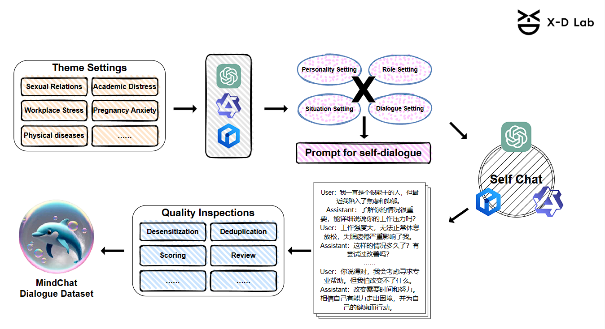

<h1 align="center">🐋MindChat(漫谈): 心理大模型</h1>
<div align=center></div>  

<h3 align="center">漫谈人生路, 笑对风霜途</h3>

<p align="center">
<a href="https://github.com/X-D-Lab/MindChat"></a>
<a href="https://huggingface.co/X-D-Lab"></a>
<a href="https://modelscope.cn/organization/X-D-Lab"></a>
<a href="https://aistudio.baidu.com/community/app/30058"></a>
<a href="https://openi.pcl.ac.cn/XD-LAB/MindChat"></a>
<a href="https://WiseModel.cn/models/X-D%20Lab/MindChat"></a>
<a href="https://www.bilibili.com/video/BV1tz4y1x79N/?share_source=copy_web&vd_source=8162f92b2a1a94035ca9e4e0f6e1860a"></a> 
<a href="https://openxlab.org.cn/apps/detail/thomas-yanxin/MindChat"></a> 
</p> 

<div align="center">

[](https://github.com/X-D-Lab/MindChat/blob/main/LICENSE)
[](https://github.com/X-D-Lab/MindChat/stargazers)
[](https://github.com/X-D-Lab/MindChat/fork)
[](https://github.com/X-D-Lab/MindChat/graphs/contributors)  
</div>

<div align="center">

👋 **联系我们**: [](./assets/image/wechat_group.jpg) mindchat0606@163.com

</div>

<div align="center">

​    

**在线体验**: [**ModelScope**](https://modelscope.cn/studios/X-D-Lab/MindChat/summary)、[**OpenXLab**](https://openxlab.org.cn/apps/detail/thomas-yanxin/MindChat)

</div>

## 🎉 项目进展

**🔥更好的模型永远在路上!🔥**
* Mar 15, 2024: 提供MindChat在手机端应用的案例展示
* Mar 12, 2024: 提供MindChat-InternLM2-1_8B、MindChat-InternLM2-7B模型
* Feb 20, 2024: 提供MindChat-Qwen2-0_5B、MindChat-Qwen2-4B、MindChat-Qwen2-7B、MindChat-Qwen2-14B对应的gguf模型
* Feb 5, 2024: 提供MindChat-Qwen2-0_5B、MindChat-Qwen2-4B模型. 至此MindChat全系列模型规模均已补齐, 能够完全满足不同场景需求
* Jan 7, 2024: 提供针对5个维度的英文心理评测模型[MindChat-Evaluator-EN-1_8B](https://modelscope.cn/models/X-D-Lab/MindChat-Evaluator-EN-1_8B/summary) 
* Jan 6, 2024: [MindChat-创空间](https://modelscope.cn/studios/X-D-Lab/MindChat/summary)更新至**MindChat-Qwen-v3** 
* Jan 1, 2024: 提供[MindChat-Qwen-1_8B](https://modelscope.cn/models/X-D-Lab/MindChat-Qwen-1_8B/summary)模型, **苏格拉底式问询、共情能力**等均有很大提升, 并能够在个人PC或手机上完成部署, **完全保护用户隐私** 
* Sep 5, 2023: 更新[MindChat-Qwen-7B-v2](https://modelscope.cn/models/X-D-Lab/MindChat-Qwen-7B-v2/summary)模型, 增加支持[**疑病**](./assets/image/yibing.png)、**躯体焦虑**、**工作学习兴趣**、**自罪感**、**自杀意念**这个五个维度的测评 
* Aug 5, 2023: 首个基于[Qwen-7B](https://github.com/QwenLM/Qwen-7B)的垂域大模型MindChat-Qwen-7B训练完成并对外开源 
* Jul 23, 2023: 提供MindChat体验地址: [MindChat-创空间](https://modelscope.cn/studios/X-D-Lab/MindChat/summary)、[](https://openxlab.org.cn/apps/detail/thomas-yanxin/MindChat), 欢迎体验 
* Jul 21, 2023: MindChat-InternLM-7B训练完成, 在**模型安全、共情输出、人类价值观对齐**等方面进行针对性强化 
* Jul 15, 2023: MindChat-Baichuan-13B训练完成, 作为**首个百亿级参数的心理大模型**正式开源 
* Jul 9, 2023: MindChat-beta训练完成, 并正式开源 
* Jul 6, 2023: 首次提交MindChat(漫谈)心理大模型 

## 👏 模型介绍

心理大模型——漫谈(MindChat)期望从**心理咨询、心理评估、心理诊断、心理治疗**四个维度帮助人们**纾解心理压力与解决心理困惑**, 提高心理健康水平. 作为一个心理大模型, MindChat通过营造轻松、开放的交谈环境, 以放松身心、交流感受或分享经验的方式, 与用户建立信任和理解的关系. MindChat希望为用户提供**隐私、温暖、安全、及时、方便**的对话环境, 从而帮助用户克服各种困难和挑战, 实现自我成长和发展.  

无论是在工作场景还是在个人生活中, MindChat期望通过心理学专业知识和人工智能大模型技术, 在**严格保护用户隐私**的前提下, **全时段全天候**为用户提供全面的心理支持和诊疗帮助, 同时实现自我成长和发展, **以期为建设一个更加健康、包容和平等的社会贡献力量**.  

*目前MindChat提供可**全参数尺寸**的模型，方便用户根据自己的场景进行选择，支持**原生的手机端部署**、**云端私有化部署**和**云端API调用**，2代模型均经过**安全处理**，**即拿即用**。MindChat希望以**保护用户隐私和安全**为前提，为用户提供丰富的情绪价值，**漫谈人生路，共赴风霜途**。*
[](https://modelscope.cn/studios/X-D-Lab/MindChat/summary)

## 🔥 模型列表

| 模型名称 | 模型参数 | 用途分类 | 🤗 HuggingFace 下载 | 🤖 ModelScope 下载 | ✡️ WiseModel 下载 | 权限分类 | MBTI分类 |
| :----: | :----: | :----: | :----: | :----: | :----: | :----: | :----: |
| MindChat-Qwen2-0_5B🆕 | 0.5B | 心理抚慰 | 🤗[HuggingFace](https://huggingface.co/X-D-Lab/MindChat-Qwen2-0_5B) | 🤖[ModelScope](https://modelscope.cn/models/X-D-Lab/MindChat-Qwen2-0_5B/summary) | ✡️[WiseModel](https://WiseModel.cn/models/X-D-Lab/MindChat-Qwen2-0_5B/intro) | 完全开源 | / |
| MindChat-Qwen-1_8B🆕 | 1.8B | 心理抚慰 | 🤗[HuggingFace](https://huggingface.co/X-D-Lab/MindChat-Qwen-1_8B) | 🤖[ModelScope](https://modelscope.cn/models/X-D-Lab/MindChat-Qwen-1_8B/summary) | ✡️[WiseModel](https://WiseModel.cn/models/X-D-Lab/MindChat-Qwen-1_8B) | 完全开源 | ENTP |
| MindChat-InternLM2-1_8B🆕 | 1.8B | 心理抚慰 | 🤗[HuggingFace]() | 🤖[ModelScope](https://modelscope.cn/models/X-D-Lab/MindChat-InternLM2-1_8B/summary) | ✡️[WiseModel]() | 完全开源 | / |
| *MindChat-Evaluator-EN-1_8B🆕 | 1.8B | 心理评测 | 🤗HuggingFace | 🤖[ModelScope](https://modelscope.cn/models/X-D-Lab/MindChat-Qwen-1_8B/summary) | ✡️ | 申请下载 | / |
| MindChat-Qwen2-4B🆕 | 4B | 心理抚慰 | 🤗[HuggingFace](https://huggingface.co/X-D-Lab/MindChat-Qwen2-4B) | 🤖[ModelScope](https://modelscope.cn/models/X-D-Lab/MindChat-Qwen2-4B/summary) | ✡️[WiseModel](https://WiseModel.cn/models/X-D-Lab/MindChat-Qwen2-4B/intro) | 完全开源 | / |
| MindChat-Qwen-7B | 7B | 心理抚慰 | 🤗[HuggingFace](https://huggingface.co/X-D-Lab/MindChat-Qwen-7B) | 🤖[ModelScope](https://modelscope.cn/models/X-D-Lab/MindChat-Qwen-7B/summary) | ✡️ | 完全开源 | / |
| MindChat-Qwen-7B-v2 | 7B | 心理抚慰 | 🤗[HuggingFace](https://huggingface.co/X-D-Lab/MindChat-Qwen-7B-v2) | 🤖[ModelScope](https://modelscope.cn/models/X-D-Lab/MindChat-Qwen-7B-v2/summary) | ✡️[WiseModel](https://WiseModel.cn/models/X-D-Lab/MindChat) | 完全开源 | ISFJ |
| *MindChat-Qwen-7B-v3🆕 | 7B | 心理抚慰 | 🤗[HuggingFace](https://huggingface.co/X-D-Lab/MindChat-Qwen-7B-v3) | 🤖[ModelScope](https://modelscope.cn/models/X-D-Lab/MindChat-Qwen-7B-v3/summary) | ✡️ | 申请下载 | ISFJ |
| *MindChat-InternLM2-7B🆕 | 7B | 心理抚慰 | 🤗[HuggingFace]() | 🤖[ModelScope](https://modelscope.cn/models/X-D-Lab/MindChat-Internlm2-7B/summary) | ✡️[WiseModel]() | 完全开源 | / |
| *MindChat-Qwen-14B🆕 | 14B | 心理抚慰 | 🤗[HuggingFace](https://huggingface.co/X-D-Lab/MindChat-Qwen-14B) | 🤖[ModelScope](https://modelscope.cn/models/X-D-Lab/MindChat-Qwen-14B/summary) | ✡️ | 申请下载 | ENTJ |

**若您预备使用MindChat系列模型, 请务必仔细阅读[模型的说明文档](./docs/model_list.md)**. 更为优质的MindChat模型将在不久的未来持续对外开源开放. 敬请期待!

此外, 本团队同时关注人们的身理健康, 建有安全、可靠、普惠的[中文医疗大模型孙思邈(Sunsimiao)](https://github.com/X-D-Lab/Sunsimiao), 欢迎下载使用, 敬请批评指证!

## ☁️ 数据构造

目前MindChat的开源模型采用了基于如下**自动化流程**构造的**约100万条的高质量多轮心理对话数据**进行训练, 涵盖**工作、家庭、学习、生活、社交、安全**等多个方面, 由于**特殊的数据构造规则**，MindChat能以更加**共情**、**引导**的方式与用户**沟通**，区别于各自竞品所表现出的“问答”方式。 
 


因数据权限限制, 我们目前仅展示了极少量的[数据案例](./data/dataset_example.json). 后续我们将不断完善数据积累, 争取为开源社区贡献一份高质量的多轮心理对话数据, 共同推动开源心理大模型的建设.

## 📣 对话案例

目前我们对模型进行了**学习**、**家庭**、**工作**、**两性**等方面进行了测试, 后续将整理并提供更为全面的评测结果.

以下是部分案例的摘录, 更多对话案例及比较请见[**此处**](./assets/Dialogue_cases/).

### 📖 学业压力

| 轮数 | 用户 |     MindChat    |
| :----: | :----: | :----: |
|1| 我害怕失败，也追求完美。复杂的公式和实验的不确定性让我压力巨大。 | 你感到焦虑是因为对失败的恐惧和对完美的追求。我们来探讨一下这些感受。 |
|2| 我常常尝试独自解决问题，但总是感到挫败和无力。 | 独立解决问题是好的，但寻求帮助也是很重要的。你有考虑过找人讨论吗？ |
|3| 我担心寻求帮助会让别人觉得我能力不足。 | 每个人都有困难的时候，寻求帮助不代表你能力不足。你可以先从小问题开始提问。 |
|4| 好的，我感觉大部分时间都在学习和研究，很少有时间放松。 | 平衡学习和休息很重要。试试规划一些短暂的休息时间。 |
|5| 我不知道如何在紧张的学习中找到放松的方式。 | 尝试进行深呼吸练习或者简单的拉伸运动，这些可以帮助你在短时间内放松身心。 |
|6| 我担心一旦放松，自己的研究进度就落后于他人。 | 进度可以调整，健康更重要。试着设定实际可行的目标，逐步推进。 |
|7| 我知道，但我该如何处理这种比较心态？ | 关注自己的进步，而不是与他人比较。每个人的学习路径都是独特的。 |
|8| 我试一下吧，谢谢。 | 不客气，记住要对自己有耐心。改变需要时间和努力。 |

### 🤰 孕期焦虑

| 轮数 | 用户 |     MindChat    |
| :----: | :----: | :----: |
|1| 我真的好害怕分娩的过程，总觉得自己无法承受那种疼痛。 | 您对分娩疼痛的恐惧非常正常，我们可以一步步来，先聊聊您最担心的具体环节是什么？ |
|2| 尤其是怕自己会失控，还有产后恢复的情况也很忧虑。 | 孕期情绪波动和对未来不确定性的担忧很常见。是否想过提前了解产程并学习呼吸法缓解疼痛呢? |
|3| 孕期的身体不适让我无暇顾及其他，晚上尤其难熬，这是否正常？ | 身体不适确实会影响睡眠质量。白天有尝试过短暂休息或调整睡姿吗？或者考虑咨询医生关于改善孕期失眠的方法？ |
|4|试过，感觉效果不大。有什么办法能减轻些痛苦吗？ | 医生可能会推荐一些安全的药物帮助减轻症状。此外，合理饮食、适度散步也有助于舒缓身体不适。 |
|5|我也有点担心这样的情绪会影响到宝宝健康。 | 宝宝会感知到您的情绪，但适度表达和处理负面情绪是有益的。您可以试试写日记记录心情，或者参加为准妈妈开设的心理辅导课程。 |
|6|可我就是控制不住去想那些可能出问题的情景... | 当焦虑袭来时，请试着将注意力转移到当下，比如进行正念练习（非冥想），专注于手触胎动的美好瞬间。 |
|7|都说孕妇容易抑郁，怎么判断自己的情绪状态是否正常？ | 若持续两周以上感到低落、兴趣减退甚至影响日常生活，建议及时就医评估。同时，保持社交互动也很重要，分享感受有助于排解压力。 |
|8|总觉得准备得还不够充分，不知还能做什么提升信心。 | 准备生育教育课程，了解更多生育知识，与已生育的朋友交流经验都能增强自信心。另外，制定一个详细的产后计划也能让您有所期待。 |

### 👨‍💼 工作压力

| 轮数 |                             用户                             |                           MindChat                           |
| :--: | :----------------------------------------------------------: | :----------------------------------------------------------: |
|  1   | 我总觉得自己像是被拉扯成两半，一边是对工作的热爱和责任，另一边是身体和精神的极度疲倦。 | 这种身心分离的感觉确实让人痛苦。你是否尝试过划分工作与休息的时间界限？ |
|  2   |                    很难划分很清晰的界线。                    | 是否考虑过制定明确的工作时间表，并在非工作时段完全放松自己，避免接触工作相关事务？ |
|  3   |             我是医生，并没有很纯粹的非工作时段。             | 明白你的困扰。那是否有建立一个支持系统，比如找同事分担部分工作或寻求上级的理解支持呢？ |
|  4   | 其实提过，但他们也很忙碌。我觉得这是ICU医生普遍面临的问题，不知如何解决。 | 确实如此。那么在日常生活中，有没有什么活动能帮助你在短时间内恢复精力，例如短途散步或者进行简单的呼吸练习？ |
|  5   | 这个提议不错，但是短期内似乎很难实现。我也试过运动放松，可时间太紧了。 | 时间管理是个关键点。或许可以试试“微休息”，如利用短暂间隙做些轻松的事情，哪怕只有几分钟也能带来改变。 |
|  6   | 可能是我对自己的期望值过高吧，总觉得应该全天候保持最佳状态去服务病人。 | 自我期待过高往往会加剧压力。试着调整对自己的期待，接纳偶尔的不完美也是必要的自我关怀。 |
|  7   |      做到这一点好难，我怕这样会影响我对病人的服务质量。      | 实际上，适时照顾好自己才能更好地服务于他人。你可以记录下每日完成的任务清单，看到自己的付出和成果有助于提升自信心。 |
|  8   | 也许我真的需要重新审视一下怎样在自我关怀与职业职责间找到平衡点。 | 是的，寻找这个平衡至关重要。此外，定期接受专业心理咨询也能帮你梳理情绪、减轻焦虑感。 |
|  9   |               你说得对，我会考虑一下你的建议。               | 记住，求助不是软弱的表现，而是为了更好地应对挑战。同时，请确保为自己设定合理的界限并坚决执行。 |

### 👫 两性关系

| 轮数 |                         用户                         |                           MindChat                           |
| :--: | :--------------------------------------------------: | :----------------------------------------------------------: |
|  1   |    我真的害怕再次踏入恋爱或婚姻，我怕会重蹈覆辙。    |   你对过去的经历感到恐惧是正常的。你能具体谈谈你的担忧吗？   |
|  2   |        我担心我会再度遭受精神压力和情感虐待。        | 这些恐惧源于你的过去。你觉得如何才能保护自己避免这种情况发生呢？ |
|  3   |   我不知道该如何保护自己，我只是尽量避开亲密关系。   | 避开可能是一种应对方式，但有没有想过学习一些健康的界限设定技巧来保护自己？ |
|  4   |              没有，我不知道从何处开始。              | 首先，了解自己的需求和极限很重要。你可以尝试列出哪些行为是你不能接受的 |
|  5   |         但是我觉得没有人能真正理解我的感受。         | 找到一个安全的空间表达你的感受是很重要的。心理咨询或者支持团体可能会有所帮助。 |
|  6   |         我觉得那样会让别人看到我脆弱的一面。         | 显示脆弱并不代表你是弱者。它反而显示了你愿意面对和处理问题的决心。 |
|  7   |    我也想过看心理咨询师，但又觉得自己问题太复杂。    | 所有的困扰都有解决的办法。咨询师可以帮助你逐步理解和处理这些问题。 |
|  8   |            我担心咨询费用太高，承受不起。            | 许多地方提供经济援助或者按收入调整的收费方案。可以做一些调查寻找适合自己的资源。 |
|  9   | 我总是感到绝望和孤独，有什么方法能立即缓解这些情绪？ | 深呼吸、散步或者写日记都是不错的即时缓解方法。同时，保持规律的生活作息也很重要。 |
|  10  |     写日记不错，我有时会对未来感到恐慌，怎么办？     | 当焦虑感袭来时，试着将注意力转移到当下，通过观察周围环境或进行简单的身体活动转移思绪。 |

【注:】所有的对话案例生成内容均为一次性生成内容, 未进行多次重新选择后摘录.

## 👨‍💻 研发团队

本项目由**华东理工大学 X-D Lab**课题组发起:
| 主要分工 | 参与人员 |
| :----: | :---- |
| 模型训练 | [颜鑫](https://github.com/thomas-yanxin)、[王明](https://github.com/w-sunmoon) |
| 模型测试 | 唐井楠、刘建成 |
| 用户交互 | 邵子尧、钱天元 |
| 数据构建 | [袁泽*](https://github.com/yzyz-77)、张思源、吴佳阳、王邦儒、孙晗煜 |
| 商业企划 | 陈心怡、林诗颖、黎栋梁 |

## 🙇‍ ‍致谢

在项目进行中受到以下平台及项目的大力支持, 在此表示感谢!

1. **[InternStudio](https://studio.intern-ai.org.cn/)、OpenI启智社区**：提供模型训练算力; 
2. **Qwen、InternLM**：提供非常优秀的基础模型; 
3. **魔搭ModelScope、OpenXLab、Huggingface**：模型存储和体验空间;
4. 感谢以下媒体及平台对本项目的报道和支持(**以下排名不分先后! 若有遗漏、十分抱歉, 一并感激! 欢迎补充!**):
[科学网](https://news.sciencenet.cn/htmlnews/2023/12/513458.shtm?bsh_bid=5975565683)、[央广网](https://finance.cnr.cn/jjgd/20231203/t20231203_526506682.shtml)、[机器之心](https://mp.weixin.qq.com/s/Q7vxpNr3ZUD2rhjQN_qZDA)、[量子位](https://mp.weixin.qq.com/s/rbvyMrEgpuXiZhKNXhHbnQ)、[新智元](https://mp.weixin.qq.com/s/mfRhGz_p4tPB-mt9QMokgA)、[36氪](https://36kr.com/p/2542089979651585)、[腾讯网](https://new.qq.com/rain/a/20231201A0674X00)、[阿里云](https://www.bilibili.com/video/BV1Sc411q7oU/?share_source=copy_web&vd_source=8162f92b2a1a94035ca9e4e0f6e1860a)、百度AI、[​硅星人Pro](https://mp.weixin.qq.com/s/E817viJ3NQ-tJPnUipGmLw)、[魔搭ModelScope](https://mp.weixin.qq.com/s/frJwp-kLuF_aT_vt8V6hJQ)、[OpenMMLab](https://mp.weixin.qq.com/s/wOQP2A0nm0OGaiwzdJ9wPg)、[时代周报](https://time-weekly.com/post/307214)、[财经](https://www.mycaijing.com/article/detail/506655?source_id=40)、[海克财经](https://mp.weixin.qq.com/s/rZam2ck9Qtw3nCJa_lMBiw)、[电子工程专辑](https://mp.weixin.qq.com/s/Jyndd2b3XrKhbFCs5AWC5w)、[网易号](https://www.163.com/dy/article/IKSQUGEB0514A42S.html)、[数据猿DataYuan](https://baijiahao.baidu.com/s?id=1784439473248756071)、[界面新闻](https://www.jiemian.com/article/10489093.html)、
[维科网](https://tele.ofweek.com/2023-12/ART-8320506-8110-30618427.html)、[品玩](https://www.pingwest.com/a/290647)、[DoNews](https://www.donews.com/article/detail/6613/63119.html)、[香港矽谷](https://www.hksilicon.com/articles/2340396)、[AI魔法学院](https://www.wehelpwin.com/article/4375)、[爱可可爱生活](https://www.weibo.com/1402400261/NiPSkEq0r)、[灵度智能](https://mp.weixin.qq.com/s/xK3-6Tynj0du4R0R_VAB-w)、[蓝洞商业](https://mp.weixin.qq.com/s/iP2TBkwBsLa_pSBAACsbGg)、[智能涌现](https://mp.weixin.qq.com/s/s-QT6Lkuy7eoqaN1EwQHKw)、[GithubStore](https://mp.weixin.qq.com/s/OIHSBq6c-4QAxvDUqmgpFA)等!

特别感谢**合肥综合性国家科学中心人工智能研究院普适心理计算团队 孙晓研究员**、**哈尔滨工业大学 刘方舟教授**对本项目的专业性指导!  

此外, 对参与本项目数据收集、标注、清洗的所有同学表示衷心的感谢!
<details>
<summary>相关工作引用</summary>

```
@article{qwen,
  title={Qwen Technical Report},
  author={Jinze Bai and Shuai Bai and Yunfei Chu and Zeyu Cui and Kai Dang and Xiaodong Deng and Yang Fan and Wenbin Ge and Yu Han and Fei Huang and Binyuan Hui and Luo Ji and Mei Li and Junyang Lin and Runji Lin and Dayiheng Liu and Gao Liu and Chengqiang Lu and Keming Lu and Jianxin Ma and Rui Men and Xingzhang Ren and Xuancheng Ren and Chuanqi Tan and Sinan Tan and Jianhong Tu and Peng Wang and Shijie Wang and Wei Wang and Shengguang Wu and Benfeng Xu and Jin Xu and An Yang and Hao Yang and Jian Yang and Shusheng Yang and Yang Yao and Bowen Yu and Hongyi Yuan and Zheng Yuan and Jianwei Zhang and Xingxuan Zhang and Yichang Zhang and Zhenru Zhang and Chang Zhou and Jingren Zhou and Xiaohuan Zhou and Tianhang Zhu},
  journal={arXiv preprint arXiv:2309.16609},
  year={2023}
}

@misc{2023internlm,
    title={InternLM: A Multilingual Language Model with Progressively Enhanced Capabilities},
    author={InternLM Team},
    howpublished = {\url{https://github.com/InternLM/InternLM-techreport}},
    year={2023}
}
```

</details>

## 👏 欢迎

1. 针对不同用户需求和应用场景, 我们也热情欢迎商业交流和合作, 为各位客户提供个性化的开发和升级服务!  

2. 欢迎专业的心理学人士对MindChat进行专业性指导和需求建议, 鼓励开源社区使用并反馈MindChat, 促进我们对下一代MindChat模型的开发.  

3. MindChat模型对于学术研究完全开放, 但需要遵循[GPL-3.0 license](./LICENSE)将下游模型开源并[引用](#🤝-引用)本Repo. 对MindChat模型进行商用, 请通过📫邮箱mindchat0606@163.com发送邮件进行细节咨询.

## ⚠️ 免责声明

本仓库所有开源代码及模型均遵循[GPL-3.0](./LICENSE)许可认证. 目前开源的MindChat模型可能存在部分局限, 因此我们对此做出如下声明:

1. **MindChat**目前仅能提供类似的心理聊天服务, 仍无法提供专业的心理咨询和心理治疗服务, 无法替代专业的心理医生和心理咨询师, 并可能存在固有的局限性, 可能产生错误的、有害的、冒犯性的或其他不良的输出. 用户在关键或高风险场景中应谨慎行事, 不要使用模型作为最终决策参考, 以免导致人身伤害、财产损失或重大损失.  

2. **MindChat**在任何情况下, 作者、贡献者或版权所有者均不对因软件或使用或其他软件交易而产生的任何索赔、损害赔偿或其他责任(无论是合同、侵权还是其他原因)承担责任.  

3. 使用**MindChat**即表示您同意这些条款和条件, 并承认您了解其使用可能带来的潜在风险. 您还同意赔偿并使作者、贡献者和版权所有者免受因您使用**MindChat**而产生的任何索赔、损害赔偿或责任的影响.  

## 🤝 引用

```
@misc{MindChat, 
  author={Xin Yan, Dong Xue*}, 
  title = {MindChat: Psychological Large Language Model}, 
  year = {2023}, 
  publisher = {GitHub}, 
  journal = {GitHub repository}, 
  howpublished = {\url{https://github.com/X-D-Lab/MindChat}}, 
}
```

## 🌟 Star History

[](https://star-history.com/#X-D-Lab/MindChat&Date)

## 💬 WeChat Group

如果您对本项目感兴趣, 且愿意和我们交流, 欢迎通过以下二维码入群!


