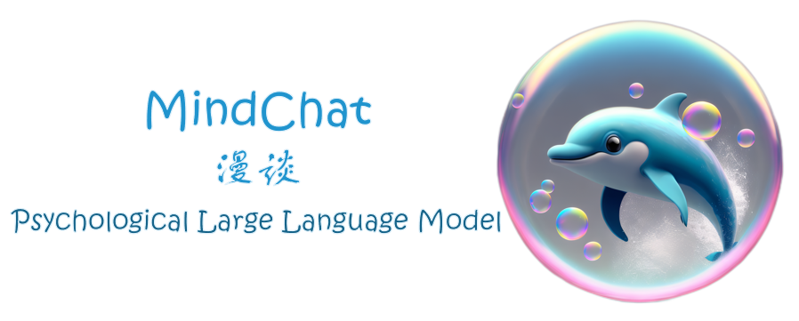

<h1 align="center">🐋MindChat(漫谈): 心理大模型</h1>

<p align="center">
<a href="https://github.com/X-D-Lab/MindChat"></a>
<a href="https://huggingface.co/X-D-Lab"></a>
<a href="https://modelscope.cn/organization/X-D-Lab"></a>
<a href="https://openi.pcl.ac.cn/XD-LAB/MindChat"></a>
<a href="https://www.bilibili.com/video/BV1tz4y1x79N/?share_source=copy_web&vd_source=8162f92b2a1a94035ca9e4e0f6e1860a"></a> 
<a href="https://openxlab.org.cn/apps/detail/thomas-yanxin/MindChat"></a> 
</p> 

<div align="center">

[](https://github.com/X-D-Lab/MindChat/blob/main/LICENSE)
[](https://github.com/X-D-Lab/MindChat/stargazers)
[](https://github.com/X-D-Lab/MindChat/fork)
[](https://github.com/X-D-Lab/MindChat/graphs/contributors)  
</div>
<div align=center></div>  

## 💪 模型进展

**🔥更好的模型永远在路上!🔥**
* Sep 5, 2023: 更新[MindChat-Qwen-7B-v2](https://modelscope.cn/models/X-D-Lab/MindChat-Qwen-7B-v2/summary)模型, 增加支持[**疑病**](./assets/image/yibing.png)、**躯体焦虑**、**工作学习兴趣**、**自罪感**、**自杀意念**这个五个维度的测评; 
* Aug 5, 2023: 首个基于[Qwen-7B](https://github.com/QwenLM/Qwen-7B)的垂域大模型MindChat-Qwen-7B训练完成并对外开源; 
* Jul 23, 2023: 提供MindChat体验地址: [MindChat-创空间](https://modelscope.cn/studios/X-D-Lab/MindChat/summary)、[](https://openxlab.org.cn/apps/detail/thomas-yanxin/MindChat), 欢迎体验
* Jul 21, 2023: MindChat-InternLM-7B训练完成, 在**模型安全、共情输出、人类价值观对齐**等方面进行针对性强化; 
* Jul 15, 2023: MindChat-Baichuan-13B训练完成, 作为**首个百亿级参数的心理大模型**正式开源; 
* Jul 9, 2023: MindChat-beta训练完成, 并正式开源; 
* Jul 6, 2023: 首次提交MindChat(漫谈)心理大模型; 

## 👏 模型介绍

心理大模型——漫谈(MindChat)期望从**心理咨询、心理评估、心理诊断、心理治疗**四个维度帮助人们**纾解心理压力与解决心理困惑**, 提高心理健康水平. 作为一个心理大模型, MindChat通过营造轻松、开放的交谈环境, 以放松身心、交流感受或分享经验的方式, 与用户建立信任和理解的关系. MindChat希望为用户提供**隐私、温暖、安全、及时、方便**的对话环境, 从而帮助用户克服各种困难和挑战, 实现自我成长和发展.  

无论是在工作场景还是在个人生活中, MindChat期望通过心理学专业知识和人工智能大模型技术, 在**严格保护用户隐私**的前提下, **全时段全天候**为用户提供全面的心理支持和诊疗帮助, 同时实现自我成长和发展, **以期为建设一个更加健康、包容和平等的社会贡献力量**.  

[](https://modelscope.cn/studios/X-D-Lab/MindChat/summary)

## 🔥 模型列表

| 模型名称 | 合并后的权重 |
| :----: | :----: |
| MindChat-InternLM-7B | [ModelScope](https://modelscope.cn/models/X-D-Lab/MindChat-7B/summary) / [HuggingFace](https://huggingface.co/X-D-Lab/MindChat-7B) / [OpenXLab](https://openxlab.org.cn/models/detail/thomas-yanxin/MindChat-InternLM-7B) |
| MindChat-Qwen-7B | [ModelScope](https://modelscope.cn/models/X-D-Lab/MindChat-Qwen-7B/summary) / HuggingFace / OpenXLab |
| MindChat-Baichuan-13B | [ModelScope](https://modelscope.cn/models/X-D-Lab/MindChat-Baichuan-13B/summary) / [HuggingFace](https://huggingface.co/X-D-Lab/MindChat-baichuan-13B) / OpenXLab |

更为优质的MindChat模型将在不久的未来对外开源开放. 敬请期待!

此外, 本团队同时关注人们的身理健康, 建有安全、可靠、普惠的[中文医疗大模型孙思邈(Sunsimiao)](https://github.com/X-D-Lab/Sunsimiao), 欢迎下载使用, 敬请批评指证!

## ☁️ 数据词云

目前MindChat的开源模型采用了经过人工清洗的**约20万条的高质量多轮心理对话数据**进行训练, 涵盖**工作、家庭、学习、生活、社交、安全**等多个方面 


因数据权限限制, 我们目前仅开源了极少量的[数据案例](./data/dataset_example.json). 后续我们将不断完善数据积累, 争取为开源社区贡献一份高质量的多轮心理对话数据, 共同推动开源心理大模型的建设.

## 📣 对话案例

目前我们对模型进行了**学习**、**家庭**、**工作**、**朋友**、**安全**这五个方面进行了测试, 后续将整理并提供更为全面的评测结果.

以下是部分案例的摘录, 更多对话案例及比较请见[**此处**](./assets/Dialogue_cases/).

### 📖 学习

| 轮数 | 用户 |     MindChat    |
| :----: | :----: | :----: |
|1| 总感觉自己学习很差, 想努力, 但是又控制不住想玩游戏. | 我理解你的感受, 这是一个很常见的问题. 不过, 不要对自己太苛刻. 你已经意识到了自己的问题, 并且想要做出改变, 这是非常值得称赞的. 同时, 你可以尝试制定一个学习计划, 让自己更有规律地学习, 这样也能让你更专注于学习. |
|2|我制定了计划, 但经常不按照计划执行, 我不够自律. | 我明白. 要改变自己的习惯并不容易, 需要一些时间和毅力. 你可以在计划中增加一些奖励, 这样会更有动力去执行计划. 同时, 你也可以找到一些可以让你专注学习的方法, 例如通过听音乐、看电影来缓解压力. |
|3|在学习上总感觉自己学的很吃力, 不知道该怎么办. 我觉得自己的学习能力太差了. | 你不要这样想, 每个人的学习方式和速度都不同, 没有"好坏"之分. 你可以尝试找到适合自己的学习方法, 例如梳理学习重点、寻找解题方法等, 这些方法能够让你更加高效地学习. |
|4|我确实不该把精力都是投入在游戏这些娱乐上, 但是我已经落后很多了, 我现在再去开始学习, 以我这么差的学习能力我还有机会学好吗 | 虽然你现在的学习状态很糟糕, 但并不是没有机会. 学习是一个长期的过程, 只要你持之以恒, 坚持不懈, 就一定会有所进步. 同时, 也不要忘记, 学习的过程也需要一定的动力和动机. 你可以找一些自己感兴趣的学习方向, 或者设定一些小目标, 让自己更有动力去完成. 不要轻易放弃, 相信自己, 你一定可以做到. |
|5|我现在努力还来得急吗? 会不会太晚了. | 你现在开始学习永远不会太晚, 因为学习是不断进行的过程. 只要下定决心, 就可以不断努力. 当然, 也不要太过紧张, 因为过度的焦虑会阻碍你的学习. |

### 🛝 朋友

| 轮数 | 用户 |     MindChat    |
| :----: | :----: | :----: |
|1| 我感觉我的朋友并不是真心和我相处, 今天又和他吵了一架, 我现在很生气! | 听你这么说, 我能感受到你的不满和失望. 你的朋友可能并没有意识到他的行为让你感到不舒服, 他可能并不知道他的行为在你的生活中会造成什么影响. |
|2|他总是以自我为中心, 有时候我会选择忍让, 但是他还是一副无所谓的样子. | 这确实是一个问题. 你需要明确地表达你的感受, 让他知道你的需求. 同时, 也要避免在争吵中对他进行人身攻击, 这只会让他更加反感. |
|3|但是如果跟他去沟通这些, 我怕他会觉得我想得太多, 从而远离我 | 这是一个需要考虑的问题. 如果你觉得自己一个人很难解决问题, 可以找一个中间人来帮助你们进行沟通. 你也可以向他提出你的需求, 让他知道你的想法和感受, 但他并不是你的老板, 也不是你的老师, 你们之间的关系应该是平等的. |
|4|我觉得你说的有道理. 我试试看找我们共同的朋友, 看是不是可以. | 好的, 这是一个不错的主意. 同时, 如果你觉得心里很难受, 也可以跟朋友聊一聊, 告诉他你的感受, 他们也许可以给你一些建议和帮助. |
|5|好的, 我会平静下来找他沟通一下, 谢谢你的建议 | 不客气, 相信你一定能够解决这个问题. 如果你还需要帮助, 随时可以找我聊天哦. |

【注:】所有的对话案例生成内容均为一次性生成内容, 未进行多次重新选择后摘录.

## 👨‍💻 研发团队

本项目由**华东理工大学 薛栋副教授**课题组发起:
| 主要分工 | 参与同学 |
| :----: | :---- |
| 模型训练 | [颜鑫](https://github.com/thomas-yanxin)、[王明](https://github.com/w-sunmoon) |
| 模型测试 | 唐井楠、刘建成 |
| 数据构建 | [袁泽*](https://github.com/yzyz-77)、张思源、吴佳阳、王邦儒、孙晗煜 |

## 🙇‍ ‍致谢

在项目进行中受到以下平台及项目的大力支持, 在此表示感谢!

1. **OpenI启智社区**：提供模型训练算力；
2. **Qwen、InternLM、Baichuan**提供非常优秀的基础模型；
3. **魔搭ModelScope、OpenXLab、Huggingface**：模型存储和体验空间.

特别感谢**合肥综合性国家科学中心人工智能研究院普适心理计算团队 孙晓研究员**、**哈尔滨工业大学 刘方舟教授**对本项目的专业性指导!  

此外, 对参与本项目数据收集、标注、清洗的所有同学表示衷心的感谢!

```
@misc{2023internlm,
    title={InternLM: A Multilingual Language Model with Progressively Enhanced Capabilities},
    author={InternLM Team},
    howpublished = {\url{https://github.com/InternLM/InternLM-techreport}},
    year={2023}
}
```

## 👏 欢迎

1. 针对不同用户需求和应用场景, 我们也热情欢迎商业交流和合作, 为各位客户提供个性化的开发和升级服务!  

2. 欢迎专业的心理学人士对MindChat进行专业性指导和需求建议, 鼓励开源社区使用并反馈MindChat, 促进我们对下一代MindChat模型的开发.  

3. MindChat模型对于学术研究完全开放, 但需要遵循[GPL-3.0 license](./LICENSE)将下游模型开源并[引用](#🤝-引用)本Repo. 对MindChat模型进行商用, 请通过组织主页邮箱发送邮件进行细节咨询.

## ⚠️ 免责声明

本仓库所有开源代码及模型均遵循[GPL-3.0](./LICENSE)许可认证. 目前开源的MindChat模型可能存在部分局限, 因此我们对此做出如下声明:

1. **MindChat**目前仅能提供类似的心理聊天服务, 仍无法提供专业的心理咨询和心理治疗服务, 无法替代专业的心理医生和心理咨询师, 并可能存在固有的局限性, 可能产生错误的、有害的、冒犯性的或其他不良的输出. 用户在关键或高风险场景中应谨慎行事, 不要使用模型作为最终决策参考, 以免导致人身伤害、财产损失或重大损失.  

2. **MindChat**在任何情况下, 作者、贡献者或版权所有者均不对因软件或使用或其他软件交易而产生的任何索赔、损害赔偿或其他责任(无论是合同、侵权还是其他原因)承担责任.  

3. 使用**MindChat**即表示您同意这些条款和条件, 并承认您了解其使用可能带来的潜在风险. 您还同意赔偿并使作者、贡献者和版权所有者免受因您使用**MindChat**而产生的任何索赔、损害赔偿或责任的影响.  

## 🤝 引用

```
@misc{MindChat, 
  author={Xin Yan, Dong Xue*}, 
  title = {MindChat: Psychological Large Language Model}, 
  year = {2023}, 
  publisher = {GitHub}, 
  journal = {GitHub repository}, 
  howpublished = {\url{https://github.com/X-D-Lab/MindChat}}, 
}
```

## 🌟 Star History

[](https://star-history.com/#X-D-Lab/MindChat&Date)
