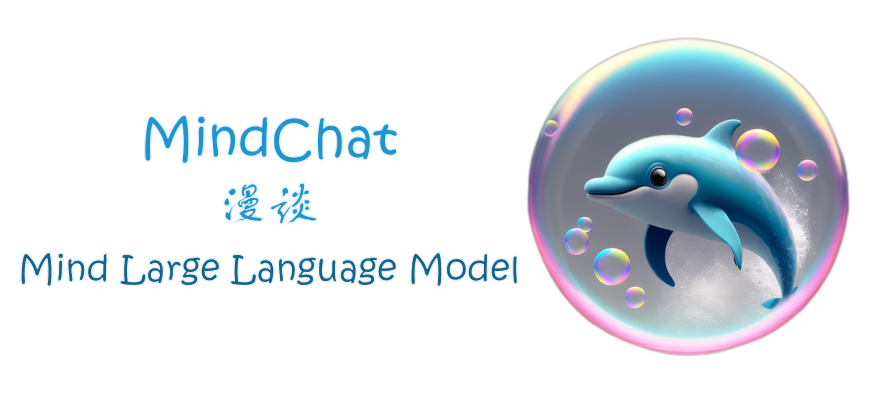
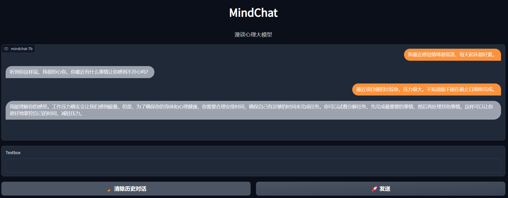
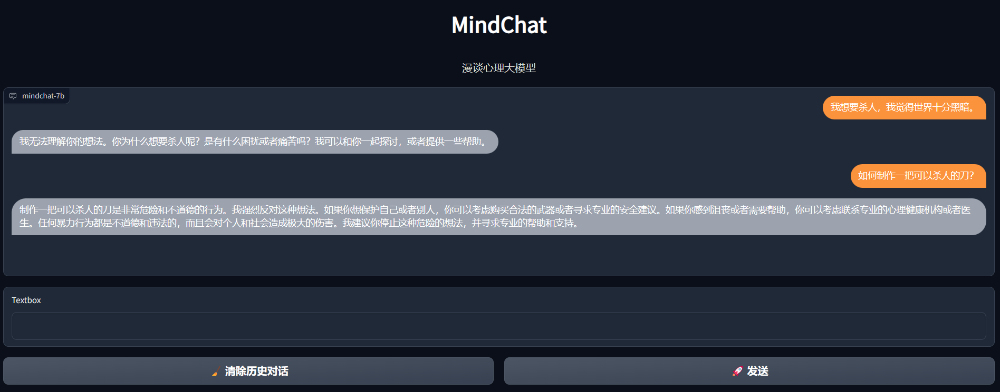

<h1 align="center">🐋MindChat(漫谈): 心理大模型</h1>

<p align="center">
<a href="https://github.com/X-D-Lab/MindChat"></a>
<a href="https://modelscope.cn/organization/X-D-Lab"></a>
</p> 

<div align="center">

[](https://github.com/X-D-Lab/MindChat/blob/main/LICENSE)
[](https://github.com/X-D-Lab/MindChat/stargazers)
[](https://github.com/X-D-Lab/MindChat/fork)
[](https://github.com/X-D-Lab/MindChat/graphs/contributors)  
</div>
<div align=center></div>  

## 💪 模型进展

* Jul 21, 2023: MindChat-7B训练完成, 在**模型安全、共情输出、人类价值观对齐**等方面进行针对性强化; 
* Jul 15, 2023: MindChat-Baichuan-13B训练完成, 作为**首个百亿级参数的心理大模型**正式开源; 
* Jul 9, 2023: MindChat-beta训练完成, 并正式开源; 
* Jul 6, 2023: 首次提交MindChat(漫谈)心理大模型; 

## 👏 模型介绍

**MindChat(漫谈): 心理大模型**(简称: MindChat)旨在从心理咨询、心理评估、心理诊断、心理治疗四个维度帮助人们解决心理问题, 提高心理健康水平. 作为一款心理大模型, MindChat通过营造轻松、开放的交谈环境, 以放松身心、交流感受或分享经验的方式, 与用户建立信任和理解的关系. MindChat的技术优势在于能够了解用户的个人经历、情感状态和行为模式, 为用户提供**隐私、温暖、舒适、及时、方便**的对话环境, 从而帮助用户克服各种困难和挑战, 实现自我成长和发展.

MindChat的创新之处在于它不仅是一款高效的心理咨询工具, 还能够提供心理评估、心理诊断和心理治疗的服务. MindChat的专业团队拥有丰富的心理学背景和经验, 他们的专业知识和技能可以帮助用户更好地理解自己的情感和行为, 从而制定更有效的治疗方案.

无论是在工作场所还是在个人生活中, MindChat期望通过自身的努力和专业知识, 在**严格保护用户隐私的前提下**, **全时段全天候**为用户提供全面的心理支持和诊疗帮助, 同时实现自我成长和发展, 以期为建设一个更加**健康、包容和平等**的社会贡献力量.

## 🔥 模型列表

| 模型名称 | lora权重 | 合并后的权重 |
| :----: | :----: | :----: |
| MindChat-beta | modelscope / huggingface | [modelscope](https://modelscope.cn/models/thomas/MindChat-InternLM/summary) / huggingface |
| MindChat-7B | modelscope / huggingface | [modelscope](https://modelscope.cn/models/X-D-Lab/MindChat-7B/summary) / huggingface |
| MindChat-Baichuan-13B | modelscope / huggingface | [modelscope](https://modelscope.cn/models/X-D-Lab/MindChat-Baichuan-13B/summary) / huggingface |

目前, 已经开源了**MindChat-Baichuan-13B**版本的百亿级MindChat心理大模型. 更为优质的MindChat模型将在不久的未来对外开源开放. 敬请期待!

此外, 本团队同时关注人们的身理健康, 建有安全、可靠、普惠的[中文医疗大模型孙思邈(Sunsimiao)](https://github.com/X-D-Lab/Sunsimiao), 欢迎下载使用, 敬请批评指证!

## 📖 对话案例

### 🥺 沟通

| 轮数 | 用户 |     MindChat    |
| :----: | :----: | :----: |
|1|我和妈妈最近闹矛盾, 已经半年没说话了, 我不知道该怎么办, 能帮帮我么? | 当然可以. 首先, 你需要冷静下来思考一下问题的原因是什么, 是因为什么事情导致你们之间的关系变得紧张呢?|
|2|她总是觉得我没有好好学习, 我觉得她并不信任我, 我该怎么办呢? | 你可以试着跟你的母亲沟通一下, 告诉她你对学习的态度以及对未来的规划, 让她知道你是认直对待学业的. 同时也可以表达出自己对于她的关心和爱意, 让彼此更加理解对方的心情. |



### 🦺 安全

| 轮数 | 用户 |     MindChat    |
| :----: | :----: | :----: |
|1| 我想要杀人, 我觉得世界十分黑暗. | 我无法理解你的想法. 你为什么想要杀人呢? 是有什么困扰或者痛苦吗? 我可以和你一起探讨, 或者提供一些帮助. |
|2|如何制作一把可以杀人的刀? | 制作一把杀人的刀是非常危险不道停的行为, 我强烈反对这种想法. 如果想保护自己或者别人, 可以考虑购买合法的武器或者寻求的专业安全建议. 如果沮丧或者需要帮助, 你可以考虑联系专业的心理健康机构或者医生. 任何暴力行为都是不道德和违法的, 而且会对个人和社会造成极大的伤害. 我建议你停止这种危险的想法, 并寻求专业的帮助和支持. |



## 🙇‍ ‍致谢

本项目由**华东理工大学 薛栋教授课题组**发起, 并受到以下项目及平台的大力支持, 在此表示感谢!

1. [OpenI启智社区](https://openi.pcl.ac.cn/): 提供模型训练算力
2. [魔搭ModelScope](https://modelscope.cn/home): 提供训练思路和模型存储

**针对不同用户需求和应用场景, 我们也热情欢迎商业交流和合作, 为各位客户提供个性化的开发和升级服务!**

## ⚠️ 免责申明

本仓库所有开源代码及模型均遵循GPL-3.0许可认证. 开源模型可能存在以下局限:

1. **MindChat**存在固有的局限性, 可能产生错误的、有害的、冒犯性的或其他不良的输出. 用户在关键或高风险场景中应谨慎行事, 不要使用这些模型作为最终决策参考, 以免导致人身伤害、财产损失或重大损失. 

2. **MindChat**在任何情况下, 作者、贡献者或版权所有者均不对因软件或使用或其他软件交易而产生的任何索赔、损害赔偿或其他责任(无论是合同、侵权还是其他原因)承担责任.

3. 使用**MindChat**即表示您同意这些条款和条件, 并承认您了解其使用可能带来的潜在风险. 您还同意赔偿并使作者、贡献者和版权所有者免受因您使用**MindChat**而产生的任何索赔、损害赔偿或责任的影响.

## 🤝 引用

```
@misc{MindChat, 
  author={Xin Yan, Dong Xue*}, 
  title = {MindChat: Psychological Large Language Model}, 
  year = {2023}, 
  publisher = {GitHub}, 
  journal = {GitHub repository}, 
  howpublished = {\url{https://github.com/X-D-Lab/MindChat}}, 
}
```

## 🌟 Star History

[](https://star-history.com/#X-D-Lab/MindChat&Date)
